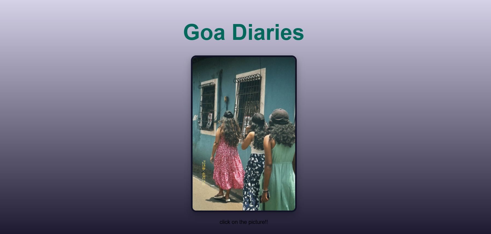

# Image Slider – Goa Diaries

This is an **Image Slider project** created as part of a web development exercise. The project showcases a responsive, automatic image carousel built with **HTML**, **CSS**, and **JavaScript**.

---

## ✨ Features

- **Front Cover Page**:
  - A welcoming cover page titled *Goa Diaries*
  - Clicking the cover image opens the image slider

- **Image Slider Carousel**:
  - Displays multiple images of Goa
  - Automatic slideshow every 2 seconds
  - Navigation arrows to move to the previous or next image manually
  - Pause slideshow on mouse hover
  - Smooth transition animations

- **Responsive Design**:
  - Works on desktop and mobile devices

---

## 📂 Project Structure
/ImageSlider
frontpage.html # Cover page (Goa Diaries)
index.html # Image Slider page
style.css # Styles for slider and cover page
script.js # JavaScript for slider functionality
README.md # Project documentation
/images # Folder with all images
1.jpg
2.jpg
3.jpg
4.jpg
5.jpg
6.jpg
7.jpg
goa.jpg # Cover page image
frontpage-screenshot.png # Screenshot of cover page
slider-screenshot.png # Screenshot of slider

---

## 🚀 How to Use

1. **Open `frontpage.html` in your browser.**
2. Click on the *Goa Diaries* image.
3. The Image Slider page (`index.html`) will open, displaying the carousel.

---

## 🔧 Technologies Used

- HTML5
- CSS3
- JavaScript ES6
- Font Awesome Icons (for navigation arrows)

---

## 🖼️ Screenshots

### Front Page

### Image Slider

---

## 📜 License

This project is for educational purposes and personal portfolio use.

---

## 🙌 Acknowledgments

- [Font Awesome](https://fontawesome.com/) for icons
- Inspiration from Goa's beautiful landscapes

---

